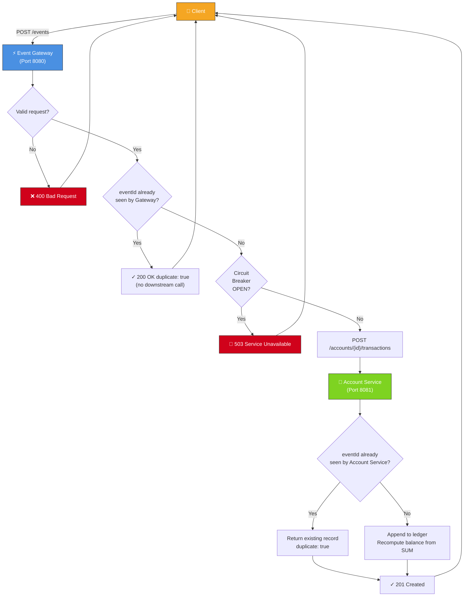

# Event Ledger

A distributed financial event ledger built with **Spring Boot 3.3.4** and **Java 17**, composed of two independently deployable microservices. The system is designed around three hard correctness guarantees: idempotent event processing, out-of-order tolerance, and graceful degradation when a downstream service fails.

---

## Architecture

```
External Client
      │
      ▼  REST  (port 8080)
┌─────────────────────────┐
│    Event Gateway        │  ← Public entry point. Validates, stores events
│                         │    locally, enforces idempotency, forwards to
│    H2 (gateway store)   │    Account Service via Circuit Breaker + Retry.
└────────────┬────────────┘
             │  REST  (port 8081)   X-Trace-Id propagated
             ▼
┌─────────────────────────┐
│    Account Service      │  ← Internal only. Manages accounts and
│                         │    transaction ledger. Balance always derived
│    H2 (account store)   │    from ledger sum — never a running counter.
└─────────────────────────┘
```

Each service owns its own H2 in-memory database. They share no schema and can be scaled, deployed, and restarted independently.

---

## Service Flow



---

## Key Design Decisions

These are the three choices that most directly affect correctness and resilience.

### 1. Out-of-Order Tolerance via Ledger-Derived Balance

Account balance is **never stored as a running counter**. Instead, every transaction is appended to an immutable ledger and the balance is recomputed as:

```sql
SUM(CREDIT amounts) - SUM(DEBIT amounts)
```

This means events can arrive in any order — the final balance is always correct because it is derived from the full history, not from incremental updates. Transaction history is returned ordered by `eventTimestamp` (business time), not by insertion time.

### 2. Defense-in-Depth Idempotency

Idempotency is enforced at **both** service boundaries independently:

| Layer | Mechanism | Behaviour on duplicate |
|-------|-----------|------------------------|
| Event Gateway | `eventId` lookup in Gateway's own H2 store | Returns existing record with `duplicate: true`, skips Account Service call entirely |
| Account Service | Unique DB constraint on `event_id` column | Returns existing transaction record, no balance change |

This means a retry storm from a client cannot double-count a transaction even if the Gateway's in-memory check is bypassed (e.g., during a rolling restart).

### 3. Circuit Breaker + Retry Composition

Resilience4j wraps every call from the Gateway to the Account Service with two layers:

```
Retry (max 1 attempt, no backoff in test / 3 attempts + exponential backoff in prod)
  └── Circuit Breaker (COUNT_BASED, sliding window = 10, opens at 50% failure rate)
```

The **Retry** handles transient blips (brief network hiccup, single timeout) transparently. The **Circuit Breaker** handles sustained failure — once the failure rate exceeds the threshold, the circuit opens and subsequent calls fail immediately without touching the Account Service. This prevents the Gateway's thread pool from draining while waiting on a consistently unavailable downstream.

`HttpServerErrorException` (5xx responses) and `ResourceAccessException` (network-level faults) both count as failures. `HttpClientErrorException` (4xx) does not — those are caller errors, not downstream failures.

---

## API Reference

### Event Gateway (port 8080) — public

| Method | Endpoint | Description |
|--------|----------|-------------|
| `POST` | `/events` | Submit a transaction event |
| `GET` | `/events/{eventId}` | Get a single event by ID |
| `GET` | `/events?account={accountId}` | List events for an account (ordered by `eventTimestamp`) |
| `GET` | `/health` | Gateway health including Account Service dependency status |

**POST /events — request body:**
```json
{
  "eventId":        "evt-001",
  "accountId":      "acct-123",
  "type":           "CREDIT",
  "amount":         150.00,
  "currency":       "USD",
  "eventTimestamp": "2026-05-15T14:02:11Z",
  "metadata": {
    "source": "mainframe-batch",
    "batchId": "B-9042"
  }
}
```

**Response status codes:**

| Status | Meaning |
|--------|---------|
| `201 Created` | New event accepted and forwarded to Account Service |
| `200 OK` | Duplicate `eventId` — returns existing event with `"duplicate": true` |
| `400 Bad Request` | Validation failure (missing field, invalid type, zero amount) |
| `503 Service Unavailable` | Account Service unreachable or circuit breaker open |

### Account Service (port 8081) — internal

| Method | Endpoint | Description |
|--------|----------|-------------|
| `POST` | `/accounts/{accountId}/transactions` | Apply a transaction to an account |
| `GET` | `/accounts/{accountId}/balance` | Current balance |
| `GET` | `/accounts/{accountId}` | Account details + full transaction history |
| `GET` | `/health` | Service and database health |

---

## Observability

### Distributed Tracing
Every request is assigned a UUID `traceId` at the Gateway boundary (or adopted from an incoming `X-Trace-Id` header). The trace ID is:
- Bound to SLF4J MDC for the full request duration → appears automatically in every log line
- Forwarded to the Account Service via `X-Trace-Id` HTTP header
- Returned in all response headers and error bodies

This means a single `traceId` ties together logs from both services for the same client request, without a separate trace backend.

### Structured Logging
All output is JSON via `logstash-logback-encoder`. Every log entry includes `timestamp`, `level`, `message`, `logger`, `traceId`, and `service`.

### Metrics (Micrometer + Prometheus)
Exposed at `/actuator/prometheus`:

| Metric | Description |
|--------|-------------|
| `gateway.events.processed{type}` | CREDIT / DEBIT events successfully forwarded |
| `gateway.events.duplicates` | Idempotency hits at the Gateway |
| `account.transactions.processed{type}` | Transactions applied at the Account Service |
| `account.transactions.duplicates` | Idempotency hits at the Account Service |
| `http.server.requests` | Latency histograms (p50 / p90 / p95 / p99) |

Circuit breaker state, failure rate, and call counts are exposed automatically by Resilience4j's Micrometer integration.

---

## Prerequisites

- Java 17 JDK
- Maven 3.8+

---

## Building and Running

### Build both services

```bash
# From project root
cd account-service && mvn clean package -DskipTests
cd ../event-gateway && mvn clean package -DskipTests
```

### Run locally (two terminals)

```bash
# Terminal 1 — start Account Service first
java -jar account-service/target/account-service-1.0.0.jar

# Terminal 2 — start Event Gateway
java -jar event-gateway/target/event-gateway-1.0.0.jar
```

Both services use H2 in-memory databases — no external setup required.

### Run with Docker Compose

```bash
docker compose up --build
```

The gateway is available at `http://localhost:8080`. The Account Service is internal on `http://localhost:8081`.

---

## Running Tests

```bash
# All tests
mvn test

# Gateway integration tests only
mvn test -Dtest=EventGatewayIntegrationTest -pl event-gateway

# Account Service integration tests only
mvn test -Dtest=AccountServiceIntegrationTest -pl account-service
```

Tests use WireMock to stub the Account Service for Gateway tests. No external processes are required.

---

## Quick Smoke Test

```bash
# 1. Submit a CREDIT
curl -s -X POST http://localhost:8080/events \
  -H "Content-Type: application/json" \
  -d '{
    "eventId":"evt-1","accountId":"acct-100",
    "type":"CREDIT","amount":500.00,"currency":"USD",
    "eventTimestamp":"2026-01-01T10:00:00Z"
  }' | jq

# 2. Submit a DEBIT
curl -s -X POST http://localhost:8080/events \
  -H "Content-Type: application/json" \
  -d '{
    "eventId":"evt-2","accountId":"acct-100",
    "type":"DEBIT","amount":150.00,"currency":"USD",
    "eventTimestamp":"2026-01-01T11:00:00Z"
  }' | jq

# 3. Check balance — should be 350.00
curl -s http://localhost:8081/accounts/acct-100/balance | jq

# 4. Re-submit evt-1 — idempotency check: balance must still be 350.00
curl -s -X POST http://localhost:8080/events \
  -H "Content-Type: application/json" \
  -d '{
    "eventId":"evt-1","accountId":"acct-100",
    "type":"CREDIT","amount":500.00,"currency":"USD",
    "eventTimestamp":"2026-01-01T10:00:00Z"
  }' | jq '.duplicate'  # should print true

# 5. Check balance again — must still be 350.00 (not 850.00)
curl -s http://localhost:8081/accounts/acct-100/balance | jq

# 6. List events (chronological order by eventTimestamp)
curl -s "http://localhost:8080/events?account=acct-100" | jq

# 7. Health checks
curl -s http://localhost:8080/health | jq
curl -s http://localhost:8081/health | jq
```

---

## Technology Stack

| Component | Version |
|-----------|---------|
| Java | 17 |
| Spring Boot | 3.3.4 |
| Spring Data JPA | 3.3.4 |
| Resilience4j | 2.2.0 |
| H2 Database | runtime |
| Micrometer + Prometheus | bundled |
| Logstash Logback Encoder | 7.4 |
| JUnit 5 + AssertJ | bundled with Spring Boot |
| WireMock Standalone | 3.0.1 |
